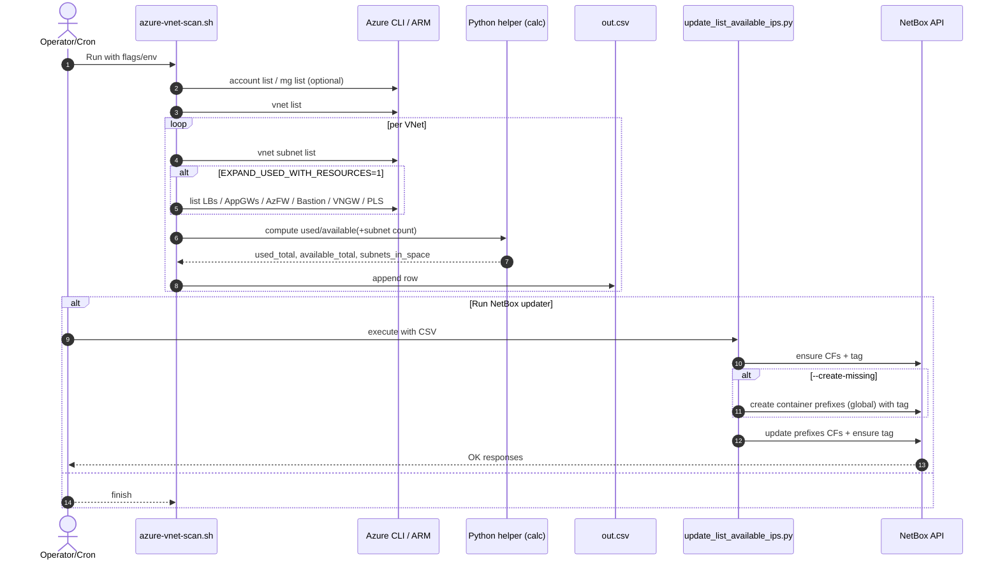
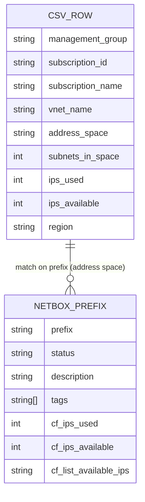

You got it. Here’s a drop‑in update to the NetBox updater so the tag ip-availables-sync is always applied to prefixes on update as well (not only when creating missing ones). It also ensures the tag exists up front.

What changed

The script always ensures the tag exists (ensure_tag called unconditionally).
On every update (for each matched prefix), it:
preserves existing tags
adds ip-availables-sync if missing
updates tags and custom fields in the same PATCH
Updated script: update_list_available_ips.py

```python
#!/usr/bin/env python3
# Force-update NetBox custom fields on IPAM > Prefixes from the CSV produced by azure-vnet-scan.sh.
# - Keeps the emoji summary in "list_available_ips"
# - Adds numeric fields: "ips_used" and "ips_available"
# - ALWAYS applies the tag "ip-availables-sync" on update and create
# - Optional: --create-missing to create global container prefixes (status=container) with the same tag
# - Status thresholds configurable via --green-th/--orange-th or env (AVAIL_GREEN_TH/AVAIL_ORANGE_TH)

import os, sys, csv, argparse, ipaddress
import pynetbox

# Custom fields
CF_SUMMARY_NAME = "list_available_ips"
CF_SUMMARY_DEF = {
    "name": CF_SUMMARY_NAME,
    "label": "List available IPs",
    "type": "text",
    "content_types": ["ipam.prefix"],
    "description": "Summary of used and available IPs in the prefix",
    "required": False,
}
CF_USED_NAME = "ips_used"
CF_USED_DEF = {
    "name": CF_USED_NAME,
    "label": "IP Used",
    "type": "integer",
    "content_types": ["ipam.prefix"],
    "description": "Number of IP addresses used in the prefix",
    "required": False,
}
CF_AVAIL_NAME = "ips_available"
CF_AVAIL_DEF = {
    "name": CF_AVAIL_NAME,
    "label": "IP Availables",
    "type": "integer",
    "content_types": ["ipam.prefix"],
    "description": "Number of IP addresses available in the prefix",
    "required": False,
}

# Tag (always enforced)
TAG_NAME = "ip-availables-sync"
TAG_SLUG = "ip-availables-sync"
TAG_COLOR = "teal"

CREATE_DESC = os.environ.get("IP_SYNC_CREATE_DESC", "⚠️ PREFIX CREATED BY IP AVAILABILITY SYNC")

def to_int(s, default=0):
    try:
        s = (s or "").replace(" ", "").replace(",", "")
        return int(float(s)) if s else default
    except Exception:
        return default

def to_float(s, default=None):
    try:
        s = (s or "").strip().replace("%", "").replace(",", ".")
        return float(s)
    except Exception:
        return default

def fmt_int(n):
    try:
        n = int(n)
    except Exception:
        return "0"
    return f"{n:,}".replace(",", " ")

def avail_pct(prefix_cidr, ips_avail, ipv4_reserved=5):
    try:
        net = ipaddress.ip_network(prefix_cidr, strict=False)
    except Exception:
        return None
    if net.version == 6:
        return None
    usable = max(net.num_addresses - ipv4_reserved, 0)
    if usable == 0:
        return None
    pct = max(0.0, min(100.0, (float(ips_avail) / float(usable)) * 100.0))
    return round(pct, 1)

def status_emoji(pct, green_th=60.0, orange_th=30.0):
    if pct is None:
        return "🔵"
    if pct >= green_th:
        return "🟢"
    if pct >= orange_th:
        return "🟠"
    return "🔴"

def make_summary(prefix_cidr, nb_subnets, ips_used, ips_avail, green_th, orange_th):
    pct = avail_pct(prefix_cidr, ips_avail)
    status = status_emoji(pct, green_th, orange_th)
    line = f"{status} | 🧩 Subnets: {fmt_int(nb_subnets)} | 🔴 Used: {fmt_int(ips_used)} | 🟢 Available: {fmt_int(ips_avail)}"
    if pct is not None:
        line += f" | ⚖️ {pct}%"
    return line

def find_col(fieldnames, candidates):
    lower = { (fn or "").strip().lower(): fn for fn in fieldnames }
    for c in candidates:
        if c in lower:
            return lower[c]
    return None

def ensure_cf(nb, cf_def):
    try:
        name = cf_def["name"]
        existing = list(nb.extras.custom_fields.filter(name=name))
        if existing:
            return existing[0]
        return nb.extras.custom_fields.create(cf_def)
    except Exception as e:
        print(f"[WARN] Could not ensure custom field '{cf_def.get('name')}': {e}", file=sys.stderr)
        return None

def ensure_tag(nb):
    try:
        found = list(nb.extras.tags.filter(slug=TAG_SLUG))
        if found:
            return found[0]
        return nb.extras.tags.create({"name": TAG_NAME, "slug": TAG_SLUG, "color": TAG_COLOR})
    except Exception as e:
        print(f"[WARN] Could not ensure tag '{TAG_NAME}': {e}", file=sys.stderr)
        return None

def main():
    ap = argparse.ArgumentParser(description="Update NetBox CFs from azure-vnet-scan CSV. Always tags prefixes with 'ip-availables-sync'.")
    ap.add_argument("csv", help="CSV produced by azure-vnet-scan.sh")
    ap.add_argument("--green-th", type=float, default=None, help="🟢 threshold (%% available). Default: env AVAIL_GREEN_TH or 60")
    ap.add_argument("--orange-th", type=float, default=None, help="🟠 threshold (%% available). Default: env AVAIL_ORANGE_TH or 30")
    ap.add_argument("--strict-unique", action="store_true",
                    help="Update only when the prefix match is unique. Default: update all matches.")
    ap.add_argument("--create-missing", action="store_true",
                    help="Create container prefixes (global) when missing and tag them.")
    ap.add_argument("--no-create-cf", action="store_true",
                    help="Do not try to create custom fields if they don't exist.")
    ap.add_argument("--dry-run", action="store_true", help="Print actions; do not write to NetBox.")
    args = ap.parse_args()

    NETBOX_URL = os.environ.get("NETBOX_URL")
    NETBOX_TOKEN = os.environ.get("NETBOX_TOKEN")
    if not NETBOX_URL or not NETBOX_TOKEN:
        print("Error: set NETBOX_URL and NETBOX_TOKEN environment variables.", file=sys.stderr)
        sys.exit(2)

    green_th = to_float(os.environ.get("AVAIL_GREEN_TH"), 60.0)
    orange_th = to_float(os.environ.get("AVAIL_ORANGE_TH"), 30.0)
    if args.green_th is not None:
        green_th = args.green_th
    if args.orange_th is not None:
        orange_th = args.orange_th
    if green_th < orange_th:
        print(f"[WARN] green-th ({green_th}) < orange-th ({orange_th}) -> swapping thresholds", file=sys.stderr)
        green_th, orange_th = orange_th, green_th

    nb = pynetbox.api(NETBOX_URL, token=NETBOX_TOKEN)

    # Always ensure CFs and tag exist (unless explicitly disabled for CFs)
    if not args.no_create_cf:
        ensure_cf(nb, CF_SUMMARY_DEF)
        ensure_cf(nb, CF_USED_DEF)
        ensure_cf(nb, CF_AVAIL_DEF)
    ensure_tag(nb)

    with open(args.csv, "r", encoding="utf-8-sig", newline="") as f:
        sample = f.read(4096); f.seek(0)
        try:
            dialect = csv.Sniffer().sniff(sample, delimiters=",;")
        except Exception:
            dialect = csv.excel
        reader = csv.DictReader(f, dialect=dialect)

        cols = reader.fieldnames or []
        # Accept English or legacy French headers
        col_prefix = find_col(cols, {"address space","adresse space","prefix"})
        col_subnets = find_col(cols, {"subnets","nb subnets","nombre de subnets","nb_subnets"})
        col_used = find_col(cols, {"ips used","ips utilisées","ips utilisees","ips_used","used"})
        col_avail = find_col(cols, {"ips available","ips disponibles","ips disponible","ips_available","available"})
        if not all([col_prefix, col_subnets, col_used, col_avail]):
            print("[ERR] Missing columns. Expected: 'address space'/'prefix', 'subnets', 'ips used', 'ips available'", file=sys.stderr)
            print(f"      Detected headers: {cols}", file=sys.stderr)
            sys.exit(1)

        updated = skipped = multi = missing = created = 0

        for row in reader:
            prefix = (row.get(col_prefix) or "").strip()
            if not prefix:
                continue
            nb_subnets = to_int(row.get(col_subnets), 0)
            ips_used   = to_int(row.get(col_used), 0)
            ips_avail  = to_int(row.get(col_avail), 0)

            summary = make_summary(prefix, nb_subnets, ips_used, ips_avail, green_th, orange_th)

            matches = list(nb.ipam.prefixes.filter(prefix=prefix, limit=0))
            if not matches and args.create_missing:
                payload = {
                    "prefix": prefix,
                    "status": "container",
                    "description": CREATE_DESC,
                    "tags": [TAG_NAME],
                }
                if args.dry_run:
                    print(f"[DRY][CREATE] container prefix {prefix} (global) with tag '{TAG_NAME}'")
                else:
                    try:
                        newp = nb.ipam.prefixes.create(payload)
                        print(f"[CREATE] {prefix} (global) id={newp.id}")
                        matches = [newp]
                        created += 1
                    except Exception as e:
                        print(f"[ERR] Failed to create container prefix {prefix}: {e}", file=sys.stderr)

            if not matches:
                print(f"[MISS] Prefix not found in NetBox: {prefix}")
                missing += 1
                continue
            if args.strict_unique and len(matches) != 1:
                print(f"[SKIP] Non-unique prefix ({len(matches)} matches): {prefix}")
                skipped += 1
                continue

            for p in matches:
                # Preserve current tags and add our sync tag
                existing_tags = []
                try:
                    for t in (p.tags or []):
                        # Prefer names for write payload; fall back to slug
                        existing_tags.append(t.get("name") or t.get("slug"))
                except Exception:
                    pass
                if TAG_NAME not in existing_tags:
                    existing_tags.append(TAG_NAME)
                tags_payload = sorted(set(filter(None, existing_tags)))

                cf = p.custom_fields or {}
                cf[CF_SUMMARY_NAME] = summary
                cf[CF_USED_NAME] = ips_used
                cf[CF_AVAIL_NAME] = ips_avail

                if args.dry_run:
                    print(f"[DRY][UPDATE] {prefix}: tags={tags_payload} | {CF_SUMMARY_NAME}='{summary}' | {CF_USED_NAME}={ips_used} | {CF_AVAIL_NAME}={ips_avail}")
                else:
                    ok = p.update({"custom_fields": cf, "tags": tags_payload})
                    if ok:
                        print(f"[OK] Updated {prefix} (tags ensured)")
                        updated += 1
                    else:
                        print(f"[ERR] Update failed for {prefix}", file=sys.stderr)
            if not args.strict_unique and len(matches) > 1:
                multi += 1

    print(f"\nSummary: updated={updated}, created={created}, skipped={skipped}, multi-prefixes={multi}, missing={missing}")

if __name__ == "__main__":
    main()
```

You got it. Here’s a drop‑in update to the NetBox updater so the tag ip-availables-sync is always applied to prefixes on update as well (not only when creating missing ones). It also ensures the tag exists up front.

What changed
- The script always ensures the tag exists (ensure_tag called unconditionally).
- On every update (for each matched prefix), it:
  - preserves existing tags
  - adds ip-availables-sync if missing
  - updates tags and custom fields in the same PATCH

Updated script: update_list_available_ips.py

```python
#!/usr/bin/env python3
# Force-update NetBox custom fields on IPAM > Prefixes from the CSV produced by azure-vnet-scan.sh.
# - Keeps the emoji summary in "list_available_ips"
# - Adds numeric fields: "ips_used" and "ips_available"
# - ALWAYS applies the tag "ip-availables-sync" on update and create
# - Optional: --create-missing to create global container prefixes (status=container) with the same tag
# - Status thresholds configurable via --green-th/--orange-th or env (AVAIL_GREEN_TH/AVAIL_ORANGE_TH)

import os, sys, csv, argparse, ipaddress
import pynetbox

# Custom fields
CF_SUMMARY_NAME = "list_available_ips"
CF_SUMMARY_DEF = {
    "name": CF_SUMMARY_NAME,
    "label": "List available IPs",
    "type": "text",
    "content_types": ["ipam.prefix"],
    "description": "Summary of used and available IPs in the prefix",
    "required": False,
}
CF_USED_NAME = "ips_used"
CF_USED_DEF = {
    "name": CF_USED_NAME,
    "label": "IP Used",
    "type": "integer",
    "content_types": ["ipam.prefix"],
    "description": "Number of IP addresses used in the prefix",
    "required": False,
}
CF_AVAIL_NAME = "ips_available"
CF_AVAIL_DEF = {
    "name": CF_AVAIL_NAME,
    "label": "IP Availables",
    "type": "integer",
    "content_types": ["ipam.prefix"],
    "description": "Number of IP addresses available in the prefix",
    "required": False,
}

# Tag (always enforced)
TAG_NAME = "ip-availables-sync"
TAG_SLUG = "ip-availables-sync"
TAG_COLOR = "teal"

CREATE_DESC = os.environ.get("IP_SYNC_CREATE_DESC", "⚠️ PREFIX CREATED BY IP AVAILABILITY SYNC")

def to_int(s, default=0):
    try:
        s = (s or "").replace(" ", "").replace(",", "")
        return int(float(s)) if s else default
    except Exception:
        return default

def to_float(s, default=None):
    try:
        s = (s or "").strip().replace("%", "").replace(",", ".")
        return float(s)
    except Exception:
        return default

def fmt_int(n):
    try:
        n = int(n)
    except Exception:
        return "0"
    return f"{n:,}".replace(",", " ")

def avail_pct(prefix_cidr, ips_avail, ipv4_reserved=5):
    try:
        net = ipaddress.ip_network(prefix_cidr, strict=False)
    except Exception:
        return None
    if net.version == 6:
        return None
    usable = max(net.num_addresses - ipv4_reserved, 0)
    if usable == 0:
        return None
    pct = max(0.0, min(100.0, (float(ips_avail) / float(usable)) * 100.0))
    return round(pct, 1)

def status_emoji(pct, green_th=60.0, orange_th=30.0):
    if pct is None:
        return "🔵"
    if pct >= green_th:
        return "🟢"
    if pct >= orange_th:
        return "🟠"
    return "🔴"

def make_summary(prefix_cidr, nb_subnets, ips_used, ips_avail, green_th, orange_th):
    pct = avail_pct(prefix_cidr, ips_avail)
    status = status_emoji(pct, green_th, orange_th)
    line = f"{status} | 🧩 Subnets: {fmt_int(nb_subnets)} | 🔴 Used: {fmt_int(ips_used)} | 🟢 Available: {fmt_int(ips_avail)}"
    if pct is not None:
        line += f" | ⚖️ {pct}%"
    return line

def find_col(fieldnames, candidates):
    lower = { (fn or "").strip().lower(): fn for fn in fieldnames }
    for c in candidates:
        if c in lower:
            return lower[c]
    return None

def ensure_cf(nb, cf_def):
    try:
        name = cf_def["name"]
        existing = list(nb.extras.custom_fields.filter(name=name))
        if existing:
            return existing[0]
        return nb.extras.custom_fields.create(cf_def)
    except Exception as e:
        print(f"[WARN] Could not ensure custom field '{cf_def.get('name')}': {e}", file=sys.stderr)
        return None

def ensure_tag(nb):
    try:
        found = list(nb.extras.tags.filter(slug=TAG_SLUG))
        if found:
            return found[0]
        return nb.extras.tags.create({"name": TAG_NAME, "slug": TAG_SLUG, "color": TAG_COLOR})
    except Exception as e:
        print(f"[WARN] Could not ensure tag '{TAG_NAME}': {e}", file=sys.stderr)
        return None

def main():
    ap = argparse.ArgumentParser(description="Update NetBox CFs from azure-vnet-scan CSV. Always tags prefixes with 'ip-availables-sync'.")
    ap.add_argument("csv", help="CSV produced by azure-vnet-scan.sh")
    ap.add_argument("--green-th", type=float, default=None, help="🟢 threshold (%% available). Default: env AVAIL_GREEN_TH or 60")
    ap.add_argument("--orange-th", type=float, default=None, help="🟠 threshold (%% available). Default: env AVAIL_ORANGE_TH or 30")
    ap.add_argument("--strict-unique", action="store_true",
                    help="Update only when the prefix match is unique. Default: update all matches.")
    ap.add_argument("--create-missing", action="store_true",
                    help="Create container prefixes (global) when missing and tag them.")
    ap.add_argument("--no-create-cf", action="store_true",
                    help="Do not try to create custom fields if they don't exist.")
    ap.add_argument("--dry-run", action="store_true", help="Print actions; do not write to NetBox.")
    args = ap.parse_args()

    NETBOX_URL = os.environ.get("NETBOX_URL")
    NETBOX_TOKEN = os.environ.get("NETBOX_TOKEN")
    if not NETBOX_URL or not NETBOX_TOKEN:
        print("Error: set NETBOX_URL and NETBOX_TOKEN environment variables.", file=sys.stderr)
        sys.exit(2)

    green_th = to_float(os.environ.get("AVAIL_GREEN_TH"), 60.0)
    orange_th = to_float(os.environ.get("AVAIL_ORANGE_TH"), 30.0)
    if args.green_th is not None:
        green_th = args.green_th
    if args.orange_th is not None:
        orange_th = args.orange_th
    if green_th < orange_th:
        print(f"[WARN] green-th ({green_th}) < orange-th ({orange_th}) -> swapping thresholds", file=sys.stderr)
        green_th, orange_th = orange_th, green_th

    nb = pynetbox.api(NETBOX_URL, token=NETBOX_TOKEN)

    # Always ensure CFs and tag exist (unless explicitly disabled for CFs)
    if not args.no_create_cf:
        ensure_cf(nb, CF_SUMMARY_DEF)
        ensure_cf(nb, CF_USED_DEF)
        ensure_cf(nb, CF_AVAIL_DEF)
    ensure_tag(nb)

    with open(args.csv, "r", encoding="utf-8-sig", newline="") as f:
        sample = f.read(4096); f.seek(0)
        try:
            dialect = csv.Sniffer().sniff(sample, delimiters=",;")
        except Exception:
            dialect = csv.excel
        reader = csv.DictReader(f, dialect=dialect)

        cols = reader.fieldnames or []
        # Accept English or legacy French headers
        col_prefix = find_col(cols, {"address space","adresse space","prefix"})
        col_subnets = find_col(cols, {"subnets","nb subnets","nombre de subnets","nb_subnets"})
        col_used = find_col(cols, {"ips used","ips utilisées","ips utilisees","ips_used","used"})
        col_avail = find_col(cols, {"ips available","ips disponibles","ips disponible","ips_available","available"})
        if not all([col_prefix, col_subnets, col_used, col_avail]):
            print("[ERR] Missing columns. Expected: 'address space'/'prefix', 'subnets', 'ips used', 'ips available'", file=sys.stderr)
            print(f"      Detected headers: {cols}", file=sys.stderr)
            sys.exit(1)

        updated = skipped = multi = missing = created = 0

        for row in reader:
            prefix = (row.get(col_prefix) or "").strip()
            if not prefix:
                continue
            nb_subnets = to_int(row.get(col_subnets), 0)
            ips_used   = to_int(row.get(col_used), 0)
            ips_avail  = to_int(row.get(col_avail), 0)

            summary = make_summary(prefix, nb_subnets, ips_used, ips_avail, green_th, orange_th)

            matches = list(nb.ipam.prefixes.filter(prefix=prefix, limit=0))
            if not matches and args.create_missing:
                payload = {
                    "prefix": prefix,
                    "status": "container",
                    "description": CREATE_DESC,
                    "tags": [TAG_NAME],
                }
                if args.dry_run:
                    print(f"[DRY][CREATE] container prefix {prefix} (global) with tag '{TAG_NAME}'")
                else:
                    try:
                        newp = nb.ipam.prefixes.create(payload)
                        print(f"[CREATE] {prefix} (global) id={newp.id}")
                        matches = [newp]
                        created += 1
                    except Exception as e:
                        print(f"[ERR] Failed to create container prefix {prefix}: {e}", file=sys.stderr)

            if not matches:
                print(f"[MISS] Prefix not found in NetBox: {prefix}")
                missing += 1
                continue
            if args.strict_unique and len(matches) != 1:
                print(f"[SKIP] Non-unique prefix ({len(matches)} matches): {prefix}")
                skipped += 1
                continue

            for p in matches:
                # Preserve current tags and add our sync tag
                existing_tags = []
                try:
                    for t in (p.tags or []):
                        # Prefer names for write payload; fall back to slug
                        existing_tags.append(t.get("name") or t.get("slug"))
                except Exception:
                    pass
                if TAG_NAME not in existing_tags:
                    existing_tags.append(TAG_NAME)
                tags_payload = sorted(set(filter(None, existing_tags)))

                cf = p.custom_fields or {}
                cf[CF_SUMMARY_NAME] = summary
                cf[CF_USED_NAME] = ips_used
                cf[CF_AVAIL_NAME] = ips_avail

                if args.dry_run:
                    print(f"[DRY][UPDATE] {prefix}: tags={tags_payload} | {CF_SUMMARY_NAME}='{summary}' | {CF_USED_NAME}={ips_used} | {CF_AVAIL_NAME}={ips_avail}")
                else:
                    ok = p.update({"custom_fields": cf, "tags": tags_payload})
                    if ok:
                        print(f"[OK] Updated {prefix} (tags ensured)")
                        updated += 1
                    else:
                        print(f"[ERR] Update failed for {prefix}", file=sys.stderr)
            if not args.strict_unique and len(matches) > 1:
                multi += 1

    print(f"\nSummary: updated={updated}, created={created}, skipped={skipped}, multi-prefixes={multi}, missing={missing}")

if __name__ == "__main__":
    main()
```

Usage examples
- Dry run (show tags being ensured on all updates):
  NETBOX_URL=https://netbox.example.com NETBOX_TOKEN=xxx \
  python3 update_list_available_ips.py out.csv --dry-run

- Update and always ensure the ip-availables-sync tag (create missing containers if needed):
  NETBOX_URL=https://netbox.example.com NETBOX_TOKEN=xxx \
  python3 update_list_available_ips.py out.csv --create-missing

- Custom thresholds for the emoji color and %:
  NETBOX_URL=https://netbox.example.com NETBOX_TOKEN=xxx \
  python3 update_list_available_ips.py out.csv --green-th 70 --orange-th 40

This should have you fully ready for the demo: every prefix updated will carry the ip-availables-sync tag, and newly created container prefixes will as well. Want a quick “verify” one-liner to list all prefixes missing the tag after a run? I can add that, too.


Absolutely—here are ready-to-drop Mermaid .mmd files you can add to your repo. GitHub will render them directly in Markdown, and they’re also compatible with the Mermaid CLI (mmdc) if you want SVG/PNG exports.

Files to add

docs/flow.mmd
docs/sequence.mmd
docs/mapping.mmd
docs/resource_expansion.mmd
docs/flow.mmd

 ```mermaid
%% docs/flow.mmd
flowchart TD
  classDef cfg fill:#f0f9ff,stroke:#0ea5e9,color:#0c4a6e
  classDef az fill:#fefce8,stroke:#eab308,color:#713f12
  classDef sh fill:#f8fafc,stroke:#334155,color:#0f172a
  classDef py fill:#f5f3ff,stroke:#7c3aed,color:#2e1065
  classDef file fill:#ecfeff,stroke:#06b6d4,color:#0e7490
  classDef nb fill:#ecfdf5,stroke:#10b981,color:#064e3b
  classDef warn fill:#fff7ed,stroke:#f97316,color:#7c2d12
  classDef decision stroke-dasharray: 5 5

  A[Operator / Cron]:::sh --> B[azure-vnet-scan.sh]:::sh

  subgraph CFG[Config (env)]
    E1[SKIP_MG]:::cfg
    E2[AZ_TIMEOUT]:::cfg
    E3[ENABLE_IPV6]:::cfg
    E4[INCLUDE_EMPTY_SPACE]:::cfg
    E5[EXPAND_USED_WITH_RESOURCES]:::cfg
    E6[SUBS_EXCLUDE_REGEX]:::cfg
    E7[SKIP_LB | SKIP_APPGW | SKIP_AZFW | SKIP_BASTION | SKIP_VNGW | SKIP_PLS]:::cfg
  end
  B --- CFG

  B --> C[Gather subscriptions<br/>-s / -m / -a]:::az
  C --> C2[Exclude by name<br/>(SUBS_EXCLUDE_REGEX, case-insensitive)]:::sh

  C2 --> D{SKIP_MG = 1?}:::decision
  D -- Yes --> E[Skip MG mapping]:::sh
  D -- No --> F[Build Subscription → MG mapping]:::az

  E --> G
  F --> G

  G[For each subscription]:::sh --> H[az account set]:::az
  H --> I[List VNets]:::az
  I --> J[For each VNet: list subnets]:::az

  J --> K[Base used = length(subnet.ipConfigurations)]:::sh
  K --> L{EXPAND_USED_WITH_RESOURCES = 1?}:::decision
  L -- Yes --> M[Add 1 per matching resource IP:<br/>- LB (private IPv4 FRONTS)<br/>- AppGW (private IPv4 FRONTs)<br/>- Azure Firewall<br/>- Bastion<br/>- VNet Gateway<br/>- Private Link Service<br/><br/>(Skip via SKIP_* flags; may double-count)]:::az
  L -- No --> N[Skip resource expansion]:::sh
  M --> O[Build list: sid|||cidr|||used]:::sh
  N --> O

  O --> P[For each address space]:::sh
  P --> Q{Subnets in this space?}:::decision

  Q -- Yes --> R[Sum per subnet:<br/>available = size − reserved − used<br/>Reserved: IPv4=5, IPv6=2]:::py
  Q -- No --> S{INCLUDE_EMPTY_SPACE = 1?}:::decision
  S -- Yes --> T[Set used=0,<br/>available = net_size − reserved<br/>(IPv4=5, IPv6=2 if ENABLE_IPV6=1)]:::py
  S -- No --> U[Set used=0, available=0]:::py

  R --> V[Append row to CSV]:::file
  T --> V
  U --> V

  V --> W{Run NetBox updater?}:::decision
  W -- Yes --> X[update_list_available_ips.py]:::sh
  X --> Y[Ensure CFs exist:<br/>- list_available_ips (text)<br/>- ips_used (int)<br/>- ips_available (int)]:::nb
  X --> Z[Ensure tag 'ip-availables-sync'<br/>Apply tag to all updated prefixes]:::nb
  X --> AA{--create-missing?}:::decision
  AA -- Yes --> AB[Create missing container prefixes (global),<br/>tagged 'ip-availables-sync',<br/>warn description]:::nb
  AA -- No --> AC[No creation]:::nb
  AB --> AD[Patch prefixes CFs + tags]:::nb
  AC --> AD
  W -- No --> AE[Done]:::sh

  style CFG stroke-dasharray: 2 2
```





```mermaid
%% docs/resource_expansion.mmd
flowchart LR
  classDef step fill:#f8fafc,stroke:#334155,color:#0f172a
  classDef az fill:#fefce8,stroke:#eab308,color:#713f12
  classDef off fill:#f1f5f9,stroke:#cbd5e1,color:#475569,stroke-dasharray: 4 4
  classDef warn fill:#fff7ed,stroke:#f97316,color:#7c2d12
  classDef ok fill:#ecfdf5,stroke:#10b981,color:#064e3b

  A[Start resource expansion]:::step --> B{EXPAND_USED_WITH_RESOURCES = 1?}:::warn
  B -- No --> Z[Skip expansion]:::off
  B -- Yes --> C[Build subnet ID set of current VNet]:::step

  C --> LB[Load Balancers<br/>(network lb list)]:::az
  LB --> LBf{private IPv4 frontend?}:::warn
  LBf -- Yes --> LBc[if frontend subnet in VNet → used++ on that subnet]:::ok
  LBf -- No --> LBx[skip]:::off

  C --> AGW[Application Gateways<br/>(network application-gateway list)]:::az
  AGW --> AGWf{private IPv4 frontend?}:::warn
  AGWf -- Yes --> AGWc[if frontend subnet in VNet → used++]:::ok
  AGWf -- No --> AGWx[skip]:::off

  C --> FW[Azure Firewalls<br/>(resource list azureFirewalls)]:::az
  FW --> FWc[for each ipConfiguration subnet in VNet → used++]:::ok

  C --> BAS[Bastion Hosts<br/>(resource list bastionHosts)]:::az
  BAS --> BASc[for each ipConfiguration subnet in VNet → used++]:::ok

  C --> VNGW[VNet Gateways<br/>(resource list virtualNetworkGateways)]:::az
  VNGW --> VNGWc[for each ipConfiguration subnet in VNet → used++]:::ok

  C --> PLS[Private Link Services<br/>(network private-link-service list)]:::az
  PLS --> PLSc[for each ipConfiguration subnet in VNet → used++]:::ok

  class LBx,AGWx,LBf,AGWf off
```  

Absolutely—here are ready-to-drop Mermaid .mmd files you can add to your repo. GitHub will render them directly in Markdown, and they’re also compatible with the Mermaid CLI (mmdc) if you want SVG/PNG exports.

Files to add
- docs/flow.mmd
- docs/sequence.mmd
- docs/mapping.mmd
- docs/resource_expansion.mmd

docs/flow.mmd
```mermaid
%% docs/flow.mmd
flowchart TD
  classDef cfg fill:#f0f9ff,stroke:#0ea5e9,color:#0c4a6e
  classDef az fill:#fefce8,stroke:#eab308,color:#713f12
  classDef sh fill:#f8fafc,stroke:#334155,color:#0f172a
  classDef py fill:#f5f3ff,stroke:#7c3aed,color:#2e1065
  classDef file fill:#ecfeff,stroke:#06b6d4,color:#0e7490
  classDef nb fill:#ecfdf5,stroke:#10b981,color:#064e3b
  classDef warn fill:#fff7ed,stroke:#f97316,color:#7c2d12
  classDef decision stroke-dasharray: 5 5

  A[Operator / Cron]:::sh --> B[azure-vnet-scan.sh]:::sh

  subgraph CFG[Config (env)]
    E1[SKIP_MG]:::cfg
    E2[AZ_TIMEOUT]:::cfg
    E3[ENABLE_IPV6]:::cfg
    E4[INCLUDE_EMPTY_SPACE]:::cfg
    E5[EXPAND_USED_WITH_RESOURCES]:::cfg
    E6[SUBS_EXCLUDE_REGEX]:::cfg
    E7[SKIP_LB | SKIP_APPGW | SKIP_AZFW | SKIP_BASTION | SKIP_VNGW | SKIP_PLS]:::cfg
  end
  B --- CFG

  B --> C[Gather subscriptions<br/>-s / -m / -a]:::az
  C --> C2[Exclude by name<br/>(SUBS_EXCLUDE_REGEX, case-insensitive)]:::sh

  C2 --> D{SKIP_MG = 1?}:::decision
  D -- Yes --> E[Skip MG mapping]:::sh
  D -- No --> F[Build Subscription → MG mapping]:::az

  E --> G
  F --> G

  G[For each subscription]:::sh --> H[az account set]:::az
  H --> I[List VNets]:::az
  I --> J[For each VNet: list subnets]:::az

  J --> K[Base used = length(subnet.ipConfigurations)]:::sh
  K --> L{EXPAND_USED_WITH_RESOURCES = 1?}:::decision
  L -- Yes --> M[Add 1 per matching resource IP:<br/>- LB (private IPv4 FRONTS)<br/>- AppGW (private IPv4 FRONTs)<br/>- Azure Firewall<br/>- Bastion<br/>- VNet Gateway<br/>- Private Link Service<br/><br/>(Skip via SKIP_* flags; may double-count)]:::az
  L -- No --> N[Skip resource expansion]:::sh
  M --> O[Build list: sid|||cidr|||used]:::sh
  N --> O

  O --> P[For each address space]:::sh
  P --> Q{Subnets in this space?}:::decision

  Q -- Yes --> R[Sum per subnet:<br/>available = size − reserved − used<br/>Reserved: IPv4=5, IPv6=2]:::py
  Q -- No --> S{INCLUDE_EMPTY_SPACE = 1?}:::decision
  S -- Yes --> T[Set used=0,<br/>available = net_size − reserved<br/>(IPv4=5, IPv6=2 if ENABLE_IPV6=1)]:::py
  S -- No --> U[Set used=0, available=0]:::py

  R --> V[Append row to CSV]:::file
  T --> V
  U --> V

  V --> W{Run NetBox updater?}:::decision
  W -- Yes --> X[update_list_available_ips.py]:::sh
  X --> Y[Ensure CFs exist:<br/>- list_available_ips (text)<br/>- ips_used (int)<br/>- ips_available (int)]:::nb
  X --> Z[Ensure tag 'ip-availables-sync'<br/>Apply tag to all updated prefixes]:::nb
  X --> AA{--create-missing?}:::decision
  AA -- Yes --> AB[Create missing container prefixes (global),<br/>tagged 'ip-availables-sync',<br/>warn description]:::nb
  AA -- No --> AC[No creation]:::nb
  AB --> AD[Patch prefixes CFs + tags]:::nb
  AC --> AD
  W -- No --> AE[Done]:::sh

  style CFG stroke-dasharray: 2 2
```

docs/sequence.mmd


docs/mapping.mmd


docs/resource_expansion.mmd
```mermaid
%% docs/resource_expansion.mmd
flowchart LR
  classDef step fill:#f8fafc,stroke:#334155,color:#0f172a
  classDef az fill:#fefce8,stroke:#eab308,color:#713f12
  classDef off fill:#f1f5f9,stroke:#cbd5e1,color:#475569,stroke-dasharray: 4 4
  classDef warn fill:#fff7ed,stroke:#f97316,color:#7c2d12
  classDef ok fill:#ecfdf5,stroke:#10b981,color:#064e3b

  A[Start resource expansion]:::step --> B{EXPAND_USED_WITH_RESOURCES = 1?}:::warn
  B -- No --> Z[Skip expansion]:::off
  B -- Yes --> C[Build subnet ID set of current VNet]:::step

  C --> LB[Load Balancers<br/>(network lb list)]:::az
  LB --> LBf{private IPv4 frontend?}:::warn
  LBf -- Yes --> LBc[if frontend subnet in VNet → used++ on that subnet]:::ok
  LBf -- No --> LBx[skip]:::off

  C --> AGW[Application Gateways<br/>(network application-gateway list)]:::az
  AGW --> AGWf{private IPv4 frontend?}:::warn
  AGWf -- Yes --> AGWc[if frontend subnet in VNet → used++]:::ok
  AGWf -- No --> AGWx[skip]:::off

  C --> FW[Azure Firewalls<br/>(resource list azureFirewalls)]:::az
  FW --> FWc[for each ipConfiguration subnet in VNet → used++]:::ok

  C --> BAS[Bastion Hosts<br/>(resource list bastionHosts)]:::az
  BAS --> BASc[for each ipConfiguration subnet in VNet → used++]:::ok

  C --> VNGW[VNet Gateways<br/>(resource list virtualNetworkGateways)]:::az
  VNGW --> VNGWc[for each ipConfiguration subnet in VNet → used++]:::ok

  C --> PLS[Private Link Services<br/>(network private-link-service list)]:::az
  PLS --> PLSc[for each ipConfiguration subnet in VNet → used++]:::ok

  class LBx,AGWx,LBf,AGWf off
```

How to use in your repo
- Option A (rendered in README.md)
  - Create a “Diagrams” section in README.md and embed:
    - Flow:
      
    - Sequence:
      
    - Mapping:
      
    - Resource expansion:
      

- Option B (export SVG/PNG via CLI)
  - Install Mermaid CLI:
    - npm install -g @mermaid-js/mermaid-cli
  - Build:
    - mmdc -i docs/flow.mmd -o docs/flow.svg
    - mmdc -i docs/sequence.mmd -o docs/sequence.svg
    - mmdc -i docs/mapping.mmd -o docs/mapping.svg
    - mmdc -i docs/resource_expansion.mmd -o docs/resource_expansion.svg

Tip
- You can tweak colors by editing classDef lines at the top of each .mmd.
- If you want a dark-theme variant, I can supply an alt palette.

If you want an additional “data lineage” diagram showing how csv columns map to the custom fields and tag, I can add it too.


```python
#!/usr/bin/env python3
# NetBox updater: emoji summary + numeric CFs + always-apply tag.
# Safe fetch (no limit=0), robust iteration, and better error messages.

import os, sys, csv, argparse, ipaddress
import pynetbox

# --- Custom fields definitions ---
CF_SUMMARY_NAME = "list_available_ips"
CF_SUMMARY_DEF = {
    "name": CF_SUMMARY_NAME,
    "label": "List available IPs",
    "type": "text",
    "content_types": ["ipam.prefix"],
    "description": "Summary of used and available IPs in the prefix",
    "required": False,
}
CF_USED_NAME = "ips_used"
CF_USED_DEF = {
    "name": CF_USED_NAME,
    "label": "IP Used",
    "type": "integer",
    "content_types": ["ipam.prefix"],
    "description": "Number of IP addresses used in the prefix",
    "required": False,
}
CF_AVAIL_NAME = "ips_available"
CF_AVAIL_DEF = {
    "name": CF_AVAIL_NAME,
    "label": "IP Availables",
    "type": "integer",
    "content_types": ["ipam.prefix"],
    "description": "Number of IP addresses available in the prefix",
    "required": False,
}

# --- Tag (always enforced) ---
TAG_NAME = "ip-availables-sync"
TAG_SLUG = "ip-availables-sync"
TAG_COLOR = "teal"
CREATE_DESC = os.environ.get("IP_SYNC_CREATE_DESC", "⚠️ PREFIX CREATED BY IP AVAILABILITY SYNC")

# --- Helpers ---
def to_int(s, default=0):
    try:
        s = (s or "").replace(" ", "").replace(",", "")
        return int(float(s)) if s else default
    except Exception:
        return default

def to_float(s, default=None):
    try:
        s = (s or "").strip().replace("%", "").replace(",", ".")
        return float(s)
    except Exception:
        return default

def fmt_int(n):
    try:
        n = int(n)
    except Exception:
        return "0"
    return f"{n:,}".replace(",", " ")

def avail_pct(prefix_cidr, ips_avail, ipv4_reserved=5):
    try:
        net = ipaddress.ip_network(prefix_cidr, strict=False)
    except Exception:
        return None
    if net.version == 6:
        return None
    usable = max(net.num_addresses - ipv4_reserved, 0)
    if usable == 0:
        return None
    pct = max(0.0, min(100.0, (float(ips_avail) / float(usable)) * 100.0))
    return round(pct, 1)

def status_emoji(pct, green_th=60.0, orange_th=30.0):
    if pct is None:
        return "🔵"
    if pct >= green_th:
        return "🟢"
    if pct >= orange_th:
        return "🟠"
    return "🔴"

def make_summary(prefix_cidr, nb_subnets, ips_used, ips_avail, green_th, orange_th):
    pct = avail_pct(prefix_cidr, ips_avail)
    status = status_emoji(pct, green_th, orange_th)
    line = f"{status} | 🧩 Subnets: {fmt_int(nb_subnets)} | 🔴 Used: {fmt_int(ips_used)} | 🟢 Available: {fmt_int(ips_avail)}"
    if pct is not None:
        line += f" | ⚖️ {pct}%"
    return line

def find_col(fieldnames, candidates):
    lower = { (fn or "").strip().lower(): fn for fn in fieldnames }
    for c in candidates:
        if c in lower:
            return lower[c]
    return None

def ensure_cf(nb, cf_def):
    try:
        name = cf_def["name"]
        existing = list(nb.extras.custom_fields.filter(name=name))
        if existing:
            return existing[0]
        return nb.extras.custom_fields.create(cf_def)
    except Exception as e:
        print(f"[WARN] Could not ensure custom field '{cf_def.get('name')}': {e}", file=sys.stderr)
        return None

def ensure_tag(nb):
    try:
        found = list(nb.extras.tags.filter(slug=TAG_SLUG))
        if found:
            return found[0]
        return nb.extras.tags.create({"name": TAG_NAME, "slug": TAG_SLUG, "color": TAG_COLOR})
    except Exception as e:
        print(f"[WARN] Could not ensure tag '{TAG_NAME}': {e}", file=sys.stderr)
        return None

def iter_matches(nb, prefix):
    # Safe iterator: no limit=0; do not call len() on RecordSet.
    try:
        for obj in nb.ipam.prefixes.filter(prefix=prefix):
            yield obj
    except Exception as e:
        print(f"[ERR] Query failed for prefix={prefix}: {e}", file=sys.stderr)

# --- Main ---
def main():
    ap = argparse.ArgumentParser(description="Update NetBox CFs from azure-vnet-scan CSV. Always tag prefixes with 'ip-availables-sync'.")
    ap.add_argument("csv", help="CSV produced by azure-vnet-scan.sh")
    ap.add_argument("--green-th", type=float, default=None, help="🟢 threshold (%% available). Default: env AVAIL_GREEN_TH or 60")
    ap.add_argument("--orange-th", type=float, default=None, help="🟠 threshold (%% available). Default: env AVAIL_ORANGE_TH or 30")
    ap.add_argument("--strict-unique", action="store_true",
                    help="Update only when the prefix match is unique. Default: update all matches.")
    ap.add_argument("--create-missing", action="store_true",
                    help="Create container prefixes (global) when missing and tag them.")
    ap.add_argument("--no-create-cf", action="store_true",
                    help="Do not try to create custom fields if they don't exist.")
    ap.add_argument("--dry-run", action="store_true", help="Print actions; do not write to NetBox.")
    args = ap.parse_args()

    NETBOX_URL = os.environ.get("NETBOX_URL")
    NETBOX_TOKEN = os.environ.get("NETBOX_TOKEN")
    if not NETBOX_URL or not NETBOX_TOKEN:
        print("Error: set NETBOX_URL and NETBOX_TOKEN environment variables.", file=sys.stderr)
        sys.exit(2)

    green_th = to_float(os.environ.get("AVAIL_GREEN_TH"), 60.0)
    orange_th = to_float(os.environ.get("AVAIL_ORANGE_TH"), 30.0)
    if args.green_th is not None:
        green_th = args.green_th
    if args.orange_th is not None:
        orange_th = args.orange_th
    if green_th < orange_th:
        print(f"[WARN] green-th ({green_th}) < orange-th ({orange_th}) -> swapping thresholds", file=sys.stderr)
        green_th, orange_th = orange_th, green_th

    nb = pynetbox.api(NETBOX_URL, token=NETBOX_TOKEN)

    # Always ensure CFs and tag exist (unless disabled for CFs)
    if not args.no_create_cf:
        ensure_cf(nb, CF_SUMMARY_DEF)
        ensure_cf(nb, CF_USED_DEF)
        ensure_cf(nb, CF_AVAIL_DEF)
    ensure_tag(nb)

    with open(args.csv, "r", encoding="utf-8-sig", newline="") as f:
        sample = f.read(4096); f.seek(0)
        try:
            dialect = csv.Sniffer().sniff(sample, delimiters=",;")
        except Exception:
            dialect = csv.excel
        reader = csv.DictReader(f, dialect=dialect)

        cols = reader.fieldnames or []
        col_prefix = find_col(cols, {"address space","adresse space","prefix"})
        col_subnets = find_col(cols, {"subnets","nb subnets","nombre de subnets","nb_subnets"})
        col_used = find_col(cols, {"ips used","ips utilisées","ips utilisees","ips_used","used"})
        col_avail = find_col(cols, {"ips available","ips disponibles","ips disponible","ips_available","available"})
        if not all([col_prefix, col_subnets, col_used, col_avail]):
            print("[ERR] Missing columns. Expected: 'address space'/'prefix', 'subnets', 'ips used', 'ips available'", file=sys.stderr)
            print(f"      Detected headers: {cols}", file=sys.stderr)
            sys.exit(1)

        updated = skipped = multi = missing = created = 0

        for row in reader:
            prefix = (row.get(col_prefix) or "").strip()
            if not prefix:
                continue
            nb_subnets = to_int(row.get(col_subnets), 0)
            ips_used   = to_int(row.get(col_used), 0)
            ips_avail  = to_int(row.get(col_avail), 0)

            summary = make_summary(prefix, nb_subnets, ips_used, ips_avail, green_th, orange_th)

            # Collect matches safely without limit=0 and without direct len() on RecordSet
            matches = [obj for obj in iter_matches(nb, prefix)]

            if not matches and args.create_missing:
                payload = {
                    "prefix": prefix,
                    "status": "container",
                    "description": CREATE_DESC,
                    "tags": [TAG_NAME],
                }
                if args.dry_run:
                    print(f"[DRY][CREATE] container prefix {prefix} (global) with tag '{TAG_NAME}'")
                else:
                    try:
                        newp = nb.ipam.prefixes.create(payload)
                        print(f"[CREATE] {prefix} (global) id={newp.id}")
                        matches = [newp]
                        created += 1
                    except Exception as e:
                        print(f"[ERR] Failed to create container prefix {prefix}: {e}", file=sys.stderr)

            if not matches:
                print(f"[MISS] Prefix not found in NetBox: {prefix}")
                missing += 1
                continue

            if args.strict_unique and len(matches) != 1:
                print(f"[SKIP] Non-unique prefix ({len(matches)} matches): {prefix}")
                skipped += 1
                continue

            for p in matches:
                # Ensure/merge tag on the object
                existing_tags = []
                try:
                    for t in (p.tags or []):
                        existing_tags.append(t.get("name") or t.get("slug"))
                except Exception:
                    pass
                if TAG_NAME not in existing_tags:
                    existing_tags.append(TAG_NAME)
                tags_payload = sorted(set(filter(None, existing_tags)))

                cf = p.custom_fields or {}
                cf[CF_SUMMARY_NAME] = summary
                cf[CF_USED_NAME] = ips_used
                cf[CF_AVAIL_NAME] = ips_avail

                if args.dry_run:
                    print(f"[DRY][UPDATE] {prefix}: tags={tags_payload} | {CF_SUMMARY_NAME}='{summary}' | {CF_USED_NAME}={ips_used} | {CF_AVAIL_NAME}={ips_avail}")
                else:
                    try:
                        ok = p.update({"custom_fields": cf, "tags": tags_payload})
                        if ok:
                            print(f"[OK] Updated {prefix} (tags ensured)")
                            updated += 1
                        else:
                            print(f"[ERR] Update failed for {prefix}", file=sys.stderr)
                    except Exception as e:
                        # Show full error message from pynetbox, if available
                        err_text = getattr(e, "error", None) or getattr(e, "args", [""])[0]
                        print(f"[ERR] Update exception for {prefix}: {err_text}", file=sys.stderr)

            if not args.strict_unique and len(matches) > 1:
                multi += 1

    print(f"\nSummary: updated={updated}, created={created}, skipped={skipped}, multi-prefixes={multi}, missing={missing}")

if __name__ == "__main__":
    main()
```
