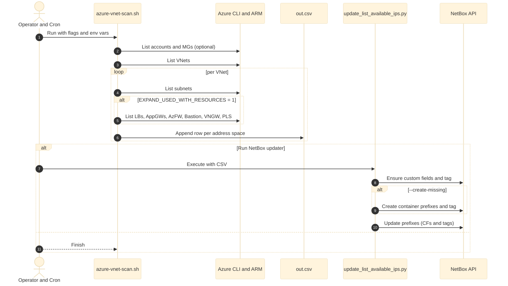
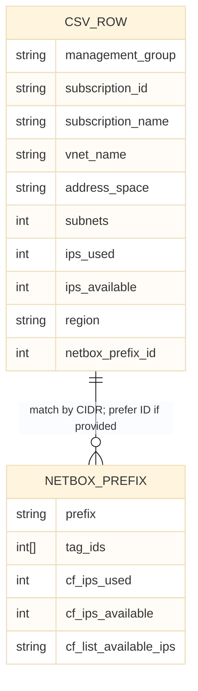
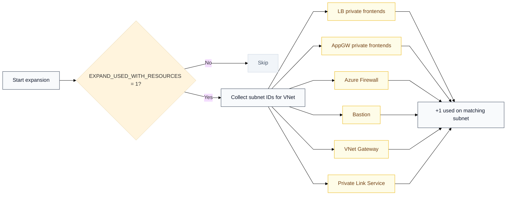

# Azure VNet IP Availability Scanner + NetBox Sync

Monitor IPv4 IP utilization across Azure VNets and sync results into NetBox Prefix custom fields and tags.

What this project gives you:

- A robust Azure scanner that outputs a per-address-space CSV:
  - subnets in space, IPs used, IPs available (Azure-reserved IPs accounted for)

- A NetBox updater that:
  - writes an emoji summary (list_available_ips) and numeric custom fields (ips_used, ips_available)
  - preserves existing tags and always enforces the ip-availables-sync tag
  - optionally creates missing container prefixes

- Optional annotator to enrich the CSV with NetBox prefix IDs (for exact, deterministic updates)
- Mermaid diagrams to document the workflow
  
- Status: battle‑tested on NetBox v4.x and Azure CLI.

---

Contents

- Summary and goals
- Requirements
- Repository layout
- CSV data model
- How it works (diagrams)
- Usage
  - 1. Run the Azure scanner
  - 2. (Optional) Annotate CSV with NetBox IDs
  - 3. Update NetBox
- Options and parameters
  - Scanner (CLI flags and env vars)
  - Updater (CLI flags)
- Troubleshooting
- Security notes
- Automation examples

---

Summary and goals

- Track IP utilization per address space in Azure (e.g., 10.0.0.0/16 in a VNet).
- Compute “IPs used” and “IPs available” like the Azure portal:
- available = size − Azure_reserved − used
- Azure reserves 5 IPs per IPv4 subnet (2 for IPv6 if enabled)
- Include address spaces with zero subnets (theoretical availability) when enabled.
- Push the results into NetBox prefixes:
  - list_available_ips (text with emoji)
  - ips_used (integer)
  - ips_available (integer)
  - Ensure tag ip-availables-sync on every updated prefix.
- Optional: create missing container prefixes (global scope) tagged ip-availables-s

---

Requirements

- Bash 5+ (mapfile builtin), coreutils (timeout)
- Azure CLI (az) logged in and authorized
  - Optional extension: account (for Management Group mapping)
  - az config set extension.use_dynamic_install=yes_without_prompt
- jq
  - Python 3.9+
- pynetbox (pip install pynetbox)
- NetBox 4.x API token (permissions to read/update prefixes and read/create tags/custom fields if you rely on auto-create)

--- 

CSV data model
Scanner CSV header (English):

```text
management group,subscription id,subscription name,vnet name,address space,subnets,ips used,ips available,region
```

- address space: VNet address space CIDR (row per address space)
- subnets: count of subnets that fall within that address space (per IP family)
- ips used: sum of used IPs across those subnets
- ips available: sum of (size − reserved − used) across those subnets
  - reserved: IPv4=5 per subnet; IPv6=2 per subnet (if ENABLE_IPV6=1)
- Empty address space behavior:
  - If INCLUDE_EMPTY_SPACE=1 (default): for IPv4, available = size − 5, used = 0
  - IPv6 theoretical availability only when ENABLE_IPV6=1
- Updater CSV (same columns, plus optional ID):
  - netbox_prefix_id (optional, recommended) for exact updates

Example:
```text
management group,subscription id,subscription name,vnet name,address space,subnets,ips used,ips available,region,netbox_prefix_id
N/A,11111111-2222-3333-4444-555555555555,Sub-Prod,vnet-hub,192.245.229.0/24,9,84,147,westeurope,1234
N/A,aaaaaaaa-bbbb-cccc-dddd-eeeeeeeeeeee,Sub-Dev,vnet-dev,10.10.0.0/16,12,210,40426,francecentral,
```


How it works (diagrams)
Flow

```mermaid
%%{init: {'theme': 'base', 'logLevel': 'error', 'flowchart': { 'curve': 'linear', 'htmlLabels': true }}}%%
flowchart TD
  classDef cfg fill:#f0f9ff,stroke:#0ea5e9,color:#0c4a6e
  classDef az fill:#fefce8,stroke:#eab308,color:#713f12
  classDef sh fill:#f8fafc,stroke:#334155,color:#0f172a
  classDef py fill:#f5f3ff,stroke:#7c3aed,color:#2e1065
  classDef file fill:#ecfeff,stroke:#06b6d4,color:#0e7490
  classDef nb fill:#ecfdf5,stroke:#10b981,color:#064e3b

  A[Operator / Cron]:::sh --> B[azure-vnet-scan.sh]:::sh

  subgraph CFG[Config env]
    E1[SKIP_MG]:::cfg
    E2[AZ_TIMEOUT]:::cfg
    E3[ENABLE_IPV6]:::cfg
    E4[INCLUDE_EMPTY_SPACE]:::cfg
    E5[EXPAND_USED_WITH_RESOURCES]:::cfg
    E6[SUBS_EXCLUDE_REGEX]:::cfg
    E7[SKIP_LB, SKIP_APPGW, SKIP_AZFW, SKIP_BASTION, SKIP_VNGW, SKIP_PLS]:::cfg
  end
  B --- CFG

  B --> C[Gather subscriptions<br/>-s / -m / -a]:::az
  C --> C2[Exclude by name &lpar;SUBS_EXCLUDE_REGEX&rpar;]:::sh

  C2 --> D{SKIP_MG = 1?}
  D -- Yes --> E[Skip MG mapping]:::sh
  D -- No --> F[Build Sub → MG mapping]:::az

  E --> G
  F --> G

  G[For each subscription]:::sh --> H[az account set]:::az
  H --> I[List VNets]:::az
  I --> J[For each VNet: list subnets]:::az

  J --> K[Base used = length of subnet.ipConfigurations]:::sh
  K --> L{EXPAND_USED_WITH_RESOURCES = 1?}
  L -- Yes --> M[Add 1 per resource IP:<br/>LB / AppGW / AzFW / Bastion / VNGW / PLS]:::az
  L -- No --> N[Skip resource expansion]:::sh
  M --> O[Build list: sid &#124;&#124;&#124; cidr &#124;&#124;&#124; used]:::sh
  N --> O

  O --> P[For each address space]:::sh
  P --> Q{Subnets in this space?}

  Q -- Yes --> R[available = size − reserved − used<br/>— IPv4=5, IPv6=2]:::py
  Q -- No --> S{INCLUDE_EMPTY_SPACE = 1?}
  S -- Yes --> T[used=0, available = net_size − reserved]:::py
  S -- No --> U[used=0, available=0]:::py

  R --> V[Append row → CSV]:::file
  T --> V
  U --> V

  V --> W{Run NetBox updater?}
  W -- Yes --> X[update_list_available_ips.py]:::sh
  X --> Y[Ensure CFs:<br/>list_available_ips, ips_used, ips_available]:::nb
  X --> Z[Ensure tag 'ip-availables-sync' and apply]:::nb
  X --> AA{--create-missing?}
  AA -- Yes --> AB[Create container prefixes &plus; tag 'ip-availables-sync']:::nb
  AA -- No --> AC[No creation]:::nb
  AB --> AD[PATCH prefixes &lpar;CFs &plus; tags&rpar;]:::nb
  AC --> AD
  W -- No --> AE[Done]:::sh

```



Sequence 


ER mapping (CSV → NetBox)



Resource expansion (optional)



Usage

1. Run the Azure scanner   
Examples:
- All subscriptions, skip MG, debug:
```text
SKIP_MG=1 AZ_TIMEOUT=30 ./azure-vnet-scan.sh -a -o out.csv -v
```

- Specific subscriptions, region filter, 20s timeout:
```text
AZ_TIMEOUT=20 ./azure-vnet-scan.sh -s "subId1,Sub Name 2" -r "westeurope,francecentral" -o out.csv -v
```

- Include IPv6 and theoretical availability for empty spaces:
```text
ENABLE_IPV6=1 INCLUDE_EMPTY_SPACE=1 ./azure-vnet-scan.sh -a -o out.csv -v
```

2. Annotate CSV with NetBox IDs
```text
NETBOX_URL=https://netbox.example.com NETBOX_TOKEN=xxx \
python3 annotate_netbox_ids.py out.csv -o out_with_ids.csv
```

3. Update NetBox
- Dry run (see CF values and tag IDs that would be applied):
```text
NETBOX_URL=https://netbox.example.com NETBOX_TOKEN=xxx \
python3 update_list_available_ips.py out_with_ids.csv --dry-run
```

- Live update (create missing container prefixes if absent):
```text
NETBOX_URL=https://netbox.example.com NETBOX_TOKEN=xxx \
python3 update_list_available_ips.py out_with_ids.csv --create-missing
```

What gets written to NetBox per prefix:

- list_available_ips (text, emoji):
  - Example: 🟢 | 🧩 Subnets: 2 | 🔴 Used: 21 | 🟢 Available: 38 | ⚖️ 66.7%
- ips_used (integer)
- ips_available (integer)
- ip-availables-sync tag (added, existing tags preserved)


Options and parameters

Scanner (azure-vnet-scan.sh)

- CLI
  -s: comma-separated subscriptions (ID or name)
  -m: Management Group (ID or name)
  -a: scan all accessible subscriptions
  -r: region filter, comma-separated (e.g., "westeurope,francecentral")
  -o: output CSV file (default: vnet-scan.csv)
  -T: az timeout per call (seconds, default: AZ_TIMEOUT or 30)
  -v / -d: verbose/debug
  -q: quiet (errors only)
  -L: log file path

- Env
  - SKIP_MG=1: skip Management Group mapping (faster)
  - AZ_TIMEOUT=30: per call timeout
  - ENABLE_IPV6=1: include IPv6 (best effort)
  - INCLUDE_EMPTY_SPACE=1: for empty address spaces, available = size − reserved
  - EXPAND_USED_WITH_RESOURCES=1: include LB/AppGW/AzFW/Bastion/VNGW/PLS in “used” (may double-count)
  - SKIP_LB=1 | SKIP_APPGW=1 | SKIP_AZFW=1 | SKIP_BASTION=1 | SKIP_VNGW=1 | SKIP_PLS=1: skip specific resource additions
  - SUBS_EXCLUDE_REGEX="DELETED": exclude subscriptions whose NAME matches this regex (case-insensitive). Set to "" to disable.

Updater (update_list_available_ips.py)

- CLI
  - --dry-run: print updates; don’t write
  - --create-missing: create missing container prefixes (global) with tag ip-availables-sync
  - --strict-unique: when matching by CIDR, only update if exactly one match
  - --green-th, --orange-th: thresholds for availability color (default 60/30)
  - --no-create-cf: don’t auto-create custom fields (assume they exist)

- Env

  - NETBOX_URL, NETBOX_TOKEN: required
  - IP_SYNC_CREATE_DESC: text for new container prefixes’ description (default: “⚠️ PREFIX CREATED BY IP AVAILABILITY SYNC”)
  - AVAIL_GREEN_TH, AVAIL_ORANGE_TH: thresholds for availability color

Annotator (annotate_netbox_ids.py)

- CLI
  - -o out_with_ids.csv: output file name
  - --strict: leave ID blank if multiple matches (default: pick a reasonable best match)

Troubleshooting

- Subscription listing or MG mapping “hangs”:
  - Use SKIP_MG=1 or install the account extension:
    - az extension add -n account
  - Increase AZ_TIMEOUT (default 30s)
- vnet-gateway jq errors:
  - We use az resource list (subscription-wide) to avoid RG-specific list calls
- “mapfile: command not found”:
  - Ensure you run with bash (not sh). mapfile is a bash builtin.
- NetBox tags update errors:
  - NetBox 4.x expects tags as numeric IDs on write. The updater preserves existing tag IDs and adds ip-availables-sync by ID.
  - If a token can’t read /extras/tags, it still works: IDs are read from the prefix payload.
- Missing CFs/tags:
  - The updater auto-creates CFs and the tag (unless --no-create-cf). You can also pre-create via UI.

Security notes

- Store NETBOX_TOKEN securely (e.g., as an environment variable in CI/cron).
- Prefer least privileges:
  - Prefixes: view and change
  - Tags: view (and create if you rely on auto-creation)
  - Custom fields: view (and create if you rely on auto-creation)
- Azure: use a service principal with the minimal Reader privileges needed to list network resources.

Automation examples

Nightly cron (03:15)

```text
15 3 * * * cd /opt/azure-ip && \
  SKIP_MG=1 AZ_TIMEOUT=30 ./azure-vnet-scan.sh -a -o out.csv -q -L scan.log && \
  NETBOX_URL=https://netbox.example.com NETBOX_TOKEN=xxxx \
  python3 update_list_available_ips.py out.csv --create-missing >> netbox-update.log 2>&1
```


  
